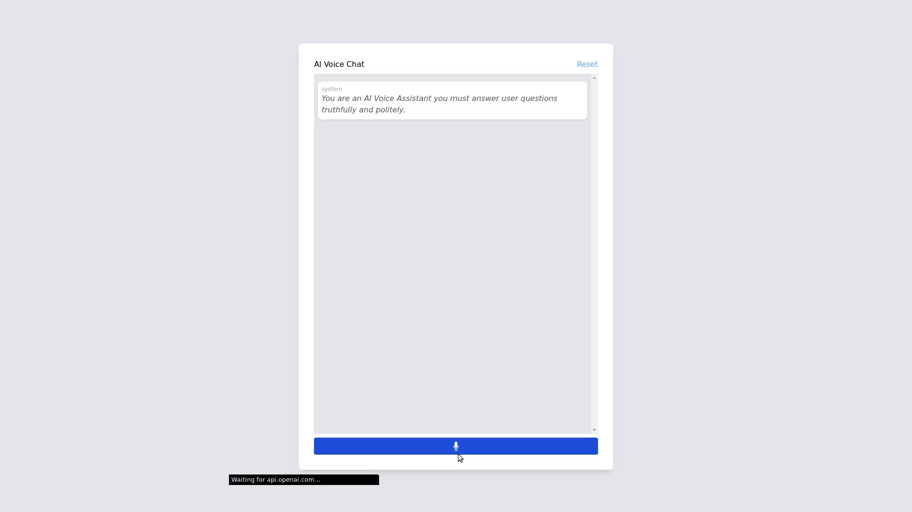

# AI Voice Chat



Simple in-browser demo of chat with AI voice responses. This project DOES NOT include a backend, all requests (transcription, chat completion, and audio synthesis) are made directly from the browser.

## Requires

- Node / NPM
- OpenAI Account
- Eleven Labs Account (Optional)

## Setup

1. Clone the repo
2. Run `npm install`
3. Create a `.env` file in the root directory
4. Add the following to the `.env` file
```bash
# Required
OPENAI_API_KEY=YOUR_OPENAI_API_KEY

# Optional
ELEVEN_LABS_API_KEY=YOUR_ELEVEN_LABS_API_KEY
ELEVEN_LABS_VOICE_ID=YOUR_ELEVEN_LABS_VOICE_ID
```
5. Run `npm run start` to start the server

## WARNING / DISCLAIMER

This is a proof of concept and is not intended for production use. It is not secure and should not be used in a production environment. It is not intended to be used for any malicious purposes. Use at your own risk.

DO NOT EXPOSE THIS OVER A NETWORK